# Specification Phase Exercise

A little exercise to get started with the specification phase of the software development lifecycle. See the [instructions](instructions.md) for more detail.

## Team Name: NYU Spaces
## Team members
Nicolas Izurieta
https://github.com/ni2050

Phoebus Yip
https://github.com/phoebusyip

Wenqian Li
https://github.com/kevinli2260

Danica Jin
https://github.com/dj9771

## Stakeholders

Interviewed: Brian Fraynd, Roberto Aguilar (Both NYU students).

Goals/Needs:

  -Find a place to eat, study, etc. at NYU.
  
  -Be able to find a quiet place to a study.
  
  -Be able to find a dining hall that doesn't have such a long wait.
  
  -Be able to identify such places in a quick, easy, and straightforward manner.

Problems/Frustrations:
  -In need of a quiet place to take an online class, or have a call or interview, but can't find an available space in time.
  
  -Need to eat, but there is only a short time to do so before the next class.
  
  -No way to know whether a given dining hall/study space is too crowded at a given point in time (without physically going there).
  
  -It's a waste of time to have to go looking around for an available study space, or to have to go to a dining hall only to find that there's a line that's too long, especially when you're in a hurry.
  

## Product Vision Statement

An app that will quickly and easily help identify available places to study and/or eat at NYU.

## User Requirements

1) As a user, I want to be able to quickly look at how many people there are currently at a specific NYU dining hall or study space, so I can decide where to go based on that.
2) As a user, I want to be able to add/remove dining halls or study spaces to a list of Favorite spaces, so I can quickly look at the occupancy numbers for the places I care most about.
3) As a user, I want to see past records of how busy individual study spaces were the week before, so I can choose the convenient times to visit.
4) As a user, I want to be able to search for a space with their name, so I can quickly find the place I want to visit in the app.
5) As a user, I want to see an associated image next to a listed NYU Dining hall or study space, so I can easily recognize the location when browsing in the app.
6) As a user, I want a mobile application that works on both IOS and Android platforms, so I can access the app regardless of the device I'm using.
7) As a user, I want to submit feedback or comments about a specific dining hall or study space, such as noise level and crowdedness, so I can let others know of my experiences and grow the app community.
8) As a user, I want to be able to change my display name and avatar, so that I can leave creative comments anonymously.
9) As a user, I want to be able to read other NYU students' experience and reviews of NYU dining halls, so that I will have as more information before making the decision of selecting which NYU space to go to.
10) As a user, I want to be able to browse all NYU study spaces and dining halls, so I can find new locations to visit.

## Diagrams

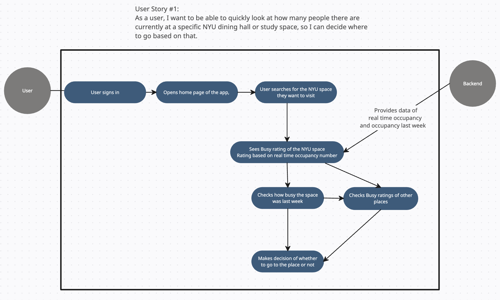
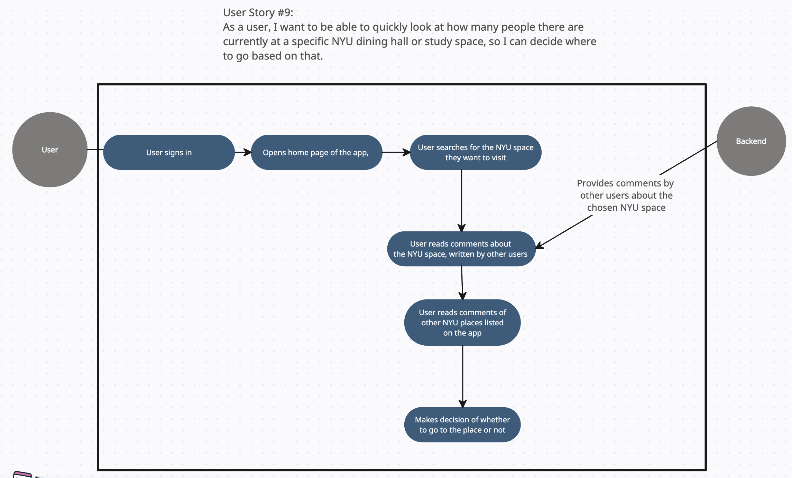

## Wireframe diagrams
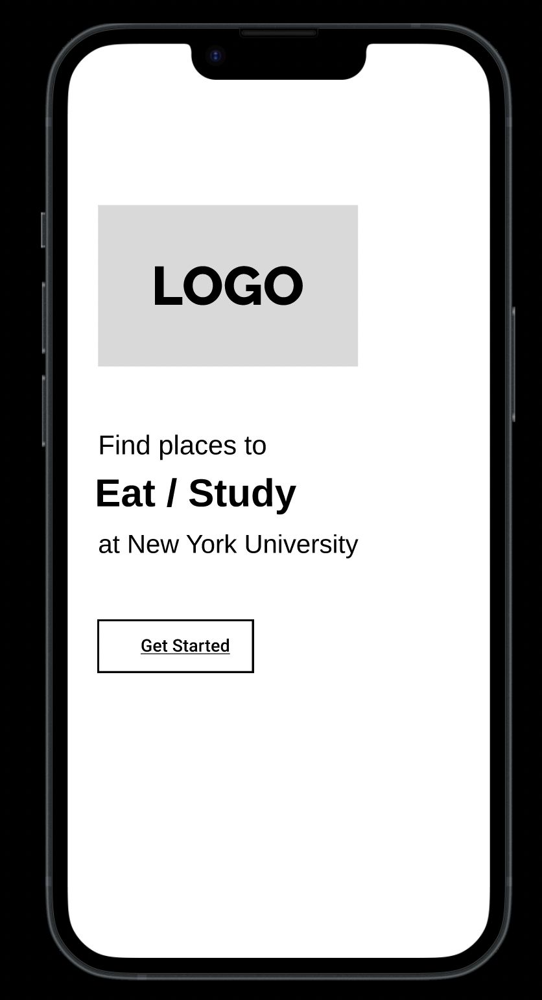
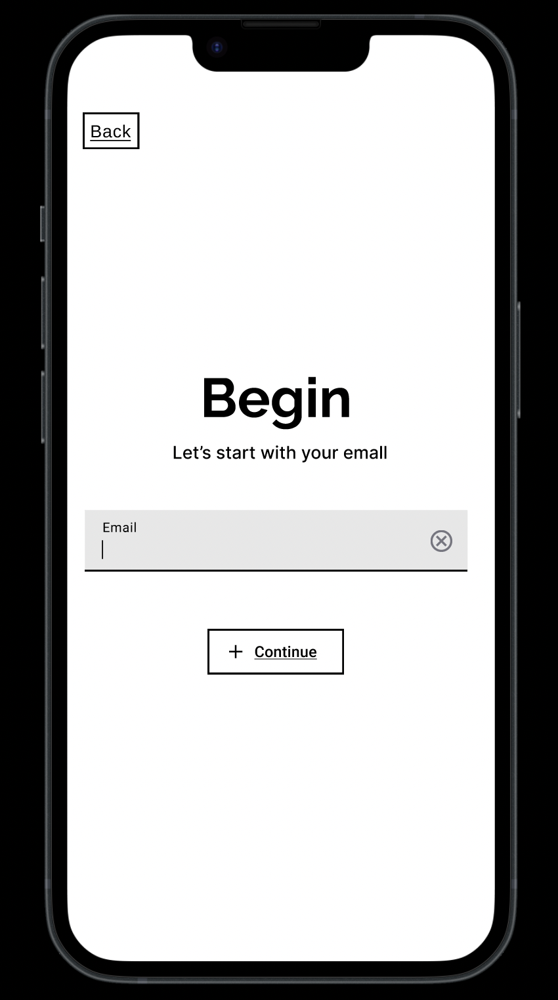
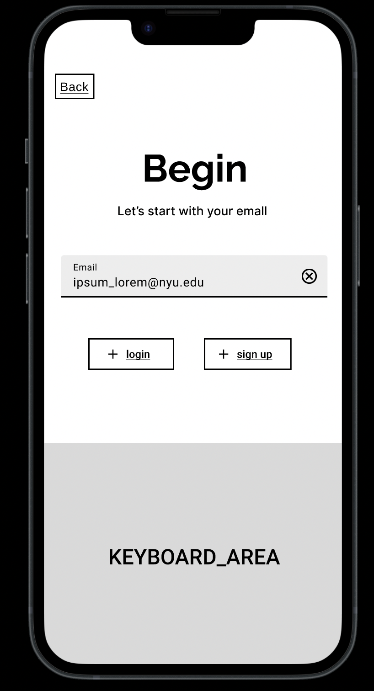
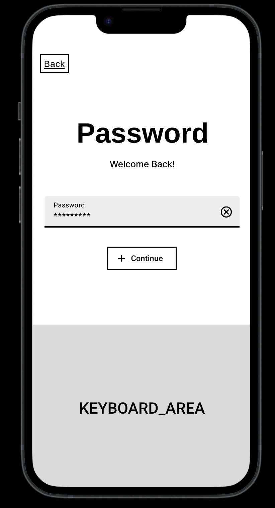
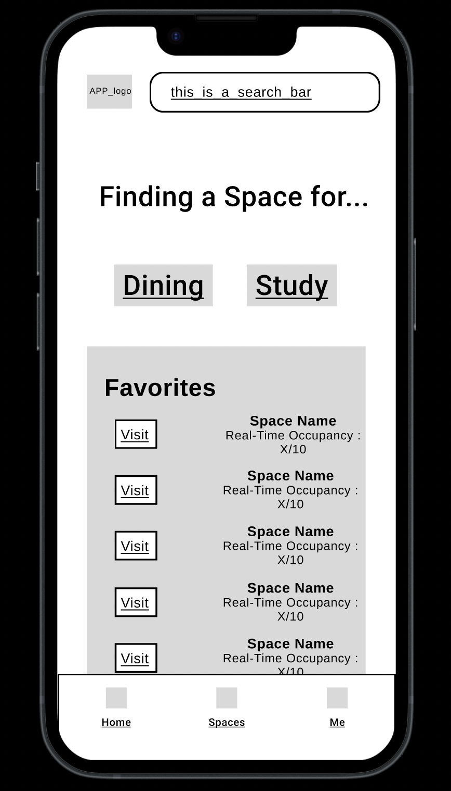
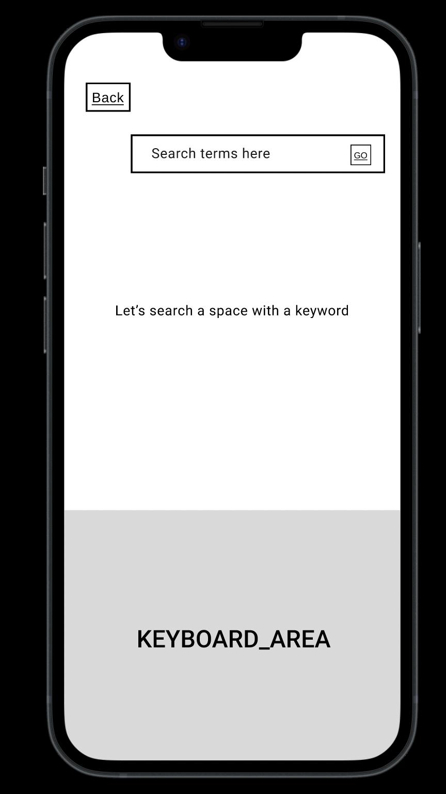

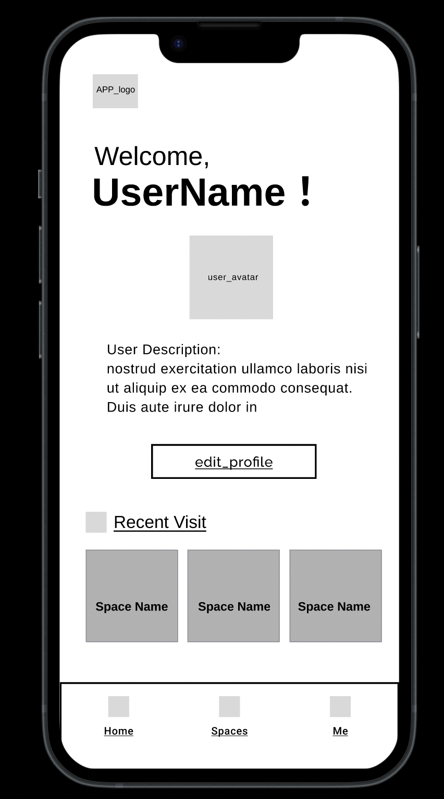
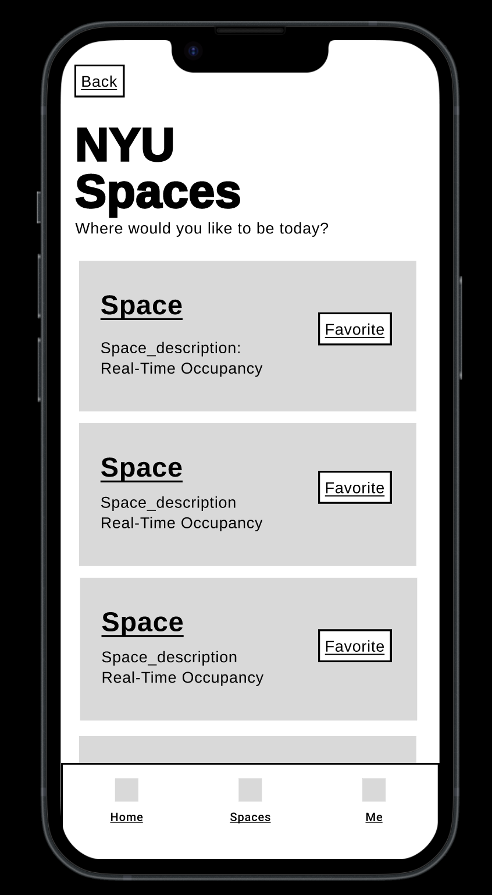
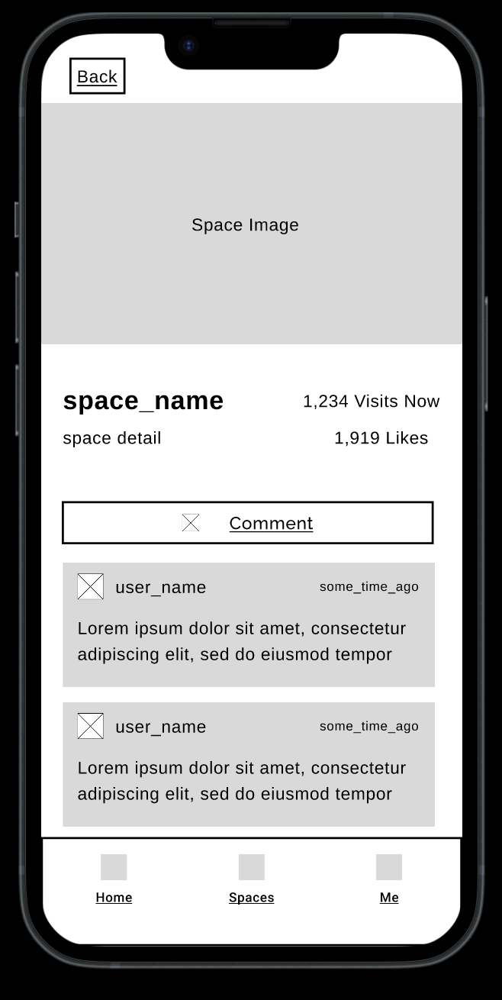
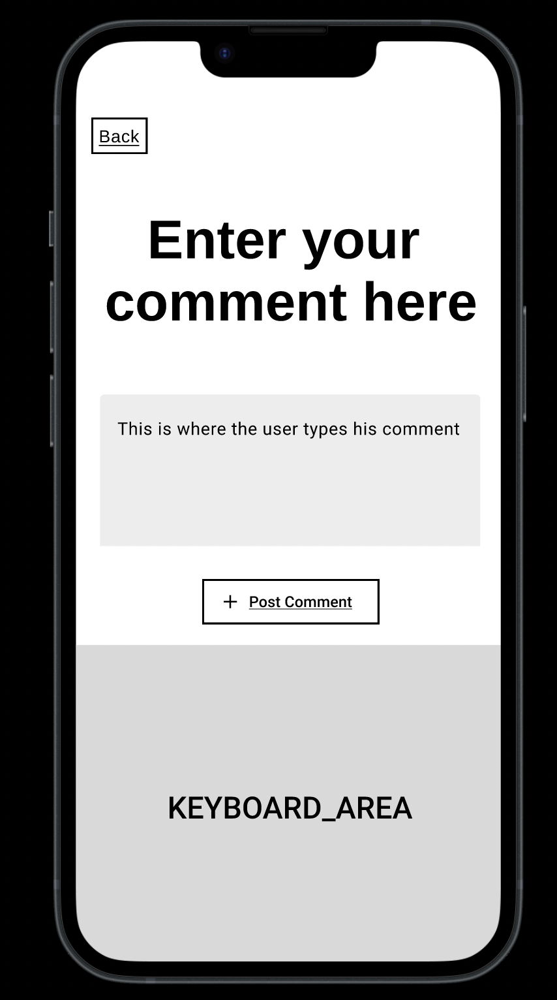
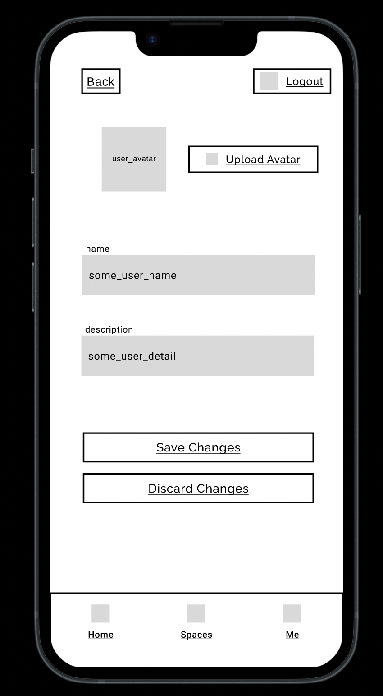
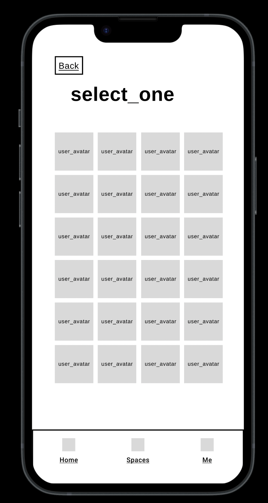

## Clickable Prototype

[Link to our Figma Clickable Prototype](https://www.figma.com/proto/3CLhPQGK7UPsN0ziwYpSzA/Project1?type=design&node-id=39-927&t=7F5Mu7Dd4ZTT4fGZ-0&scaling=scale-down&page-id=0%3A1&starting-point-node-id=2%3A1715)
